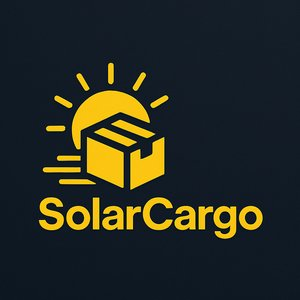

# solar-cargo-be
### 1. Create .env 
```
DJANGO_SETTINGS_MODULE=config.settings.dev
SECRET_KEY=dev-secret-key!421&&76b
POSTGRES_DB=solarCargoDb
POSTGRES_USER=solarCargoDbUser
POSTGRES_PASSWORD=solarCargoSuperSecretDbPassword
```
### 2. Build and start containers
```
docker compose up --build
```
### 3. Jump into web container
```
docker exec -it container_name bash
```
### 4. Run migrations
```
python backend/manage.py migrate
```
### 5. (Optional) Create superuser for Django admin
```
python backend/manage.py createsuperuser
```
### 6. (Optional) Plate Recognizer API
* 1. Create account at [Plate Regocnizer API](https://app.platerecognizer.com)
* 2. Add the API key to the .env
```
PLATE_RECOGNIZER_API_KEY=YOUR_API_KEY_HERE
```

Login API

```
curl -X 'POST' \
  'http://localhost:5000/api/auth/login/' \
  -H 'accept: application/json' \
  -H 'Content-Type: application/json' \
  -H 'X-CSRFTOKEN: <token>' \
  -d '{
  "username": "admin",
  "password": "admin"
}'
```
 This is generating an Api-Key, which is required for every other request.
 The way it is used is in a header:
 ```
    -H Authorization: ApiKet <generated API key>
 ```